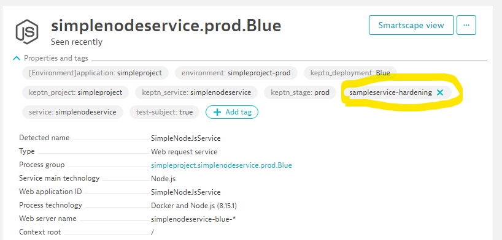
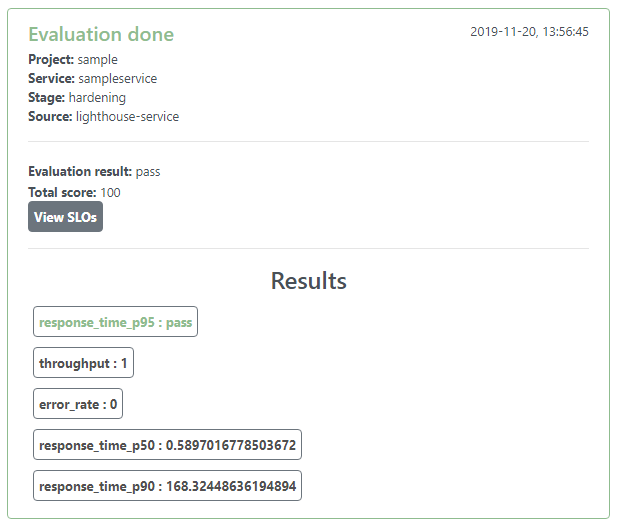
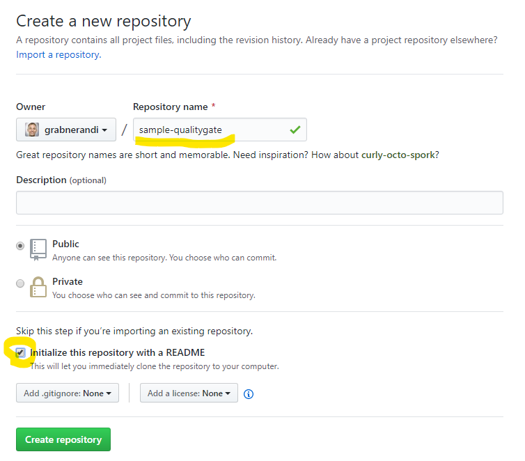
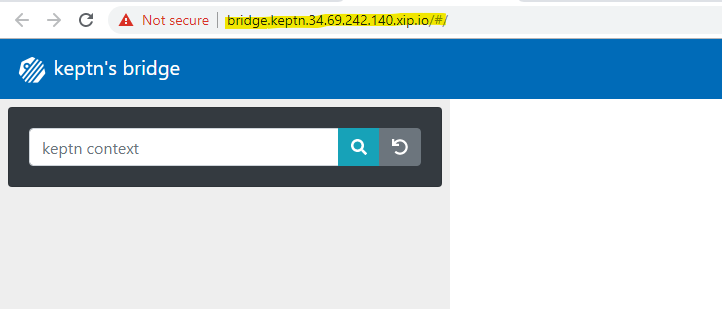
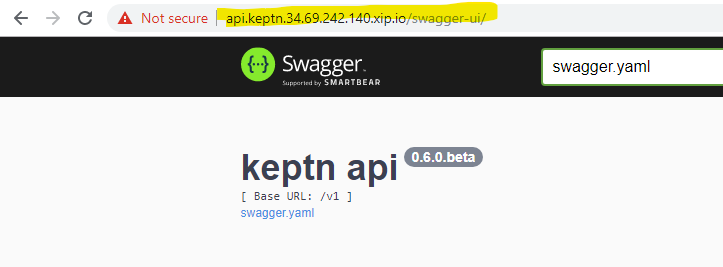
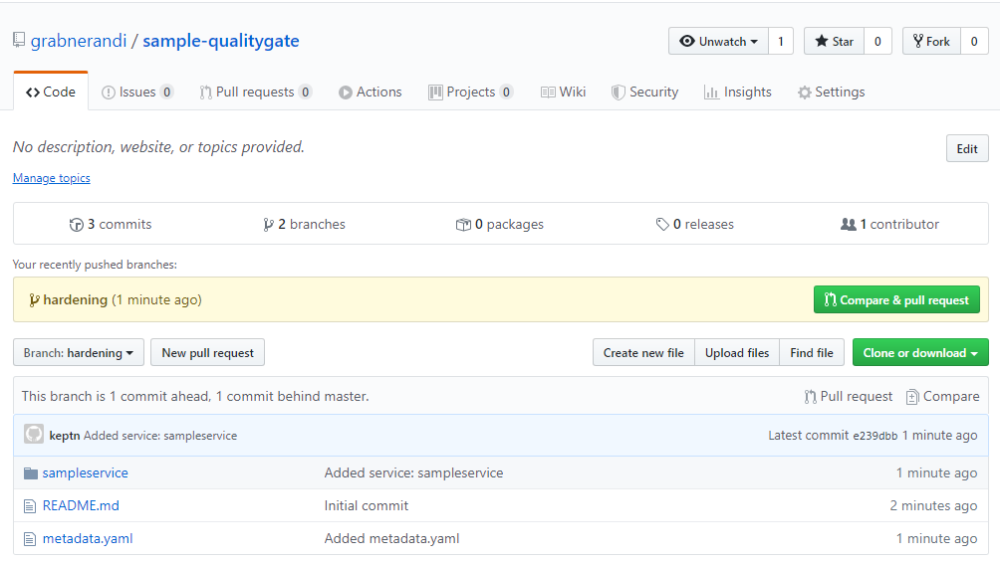
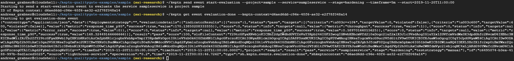
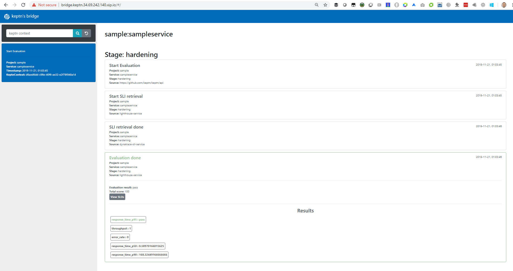

# Setting up Sample Keptn Quality Gate Project for Services monitored with Dynatrace

This example walks you through 
1. Installing keptn for the capabilty **Quality Gates only** on GKE
2. Defining SLIs (Service Level Indicators) and SLOs (Service Level Objects) for metrics from Dynatrace
3. Having keptn evaluate these SLOs when calling the Keptn CLI or the Keptn CLI for a specific timeframe

The default SLI used in the sample will query 5 different metrics from a Dynatrace monitored service leveraging the new Dynatrace Metrics API.
```
  custom-queries: |
    throughput: "builtin:service.requestCount.total:merge(0):count?scope=tag($SERVICE-$STAGE)"
    error_rate: "builtin:service.errors.total.count:merge(0):avg?scope=tag($SERVICE-$STAGE)"
    response_time_p50: "builtin:service.response.time:merge(0):percentile(50)?scope=tag($SERVICE-$STAGE)"
    response_time_p90: "builtin:service.response.time:merge(0):percentile(90)?scope=tag($SERVICE-$STAGE)"
    response_time_p95: "builtin:service.response.time:merge(0):percentile(95)?scope=tag($SERVICE-$STAGE)"
```

Later in the tutorial we are adding some custom service metrics to this list such as
```
    rt_invoke_avg: "calc:service.topurlresponsetime:filter(eq(URL,/api/invoke)):merge(0):(avg)?scope=tag($SERVICE-$STAGE)"
    count_svccalls_invoke: "calc:service.topurlservicecalls:filter(eq(URL,/api/invoke)):merge(0):(sum)?scope=tag($SERVICE-$STAGE)"
    count_dbcalls_invoke: "calc:service.topurldbcalls:filter(eq(URL,/api/invoke)):merge(0):(avg)?scope=tag($SERVICE-$STAGE)"
```

Our sample will create a keptn service called "sampleservice" and assumes there is one stage called "hardening". These names are also used to execute the queries shown above. So - the only thing we have to do for our sample to work is to put a tag on a Dynatrace monitored service with the name "sampleservice-hardening" as shown below. For the sake of this example you can put this tag on any of your monitored services but make sure it has traffic so that we actually get some data:



Keptn evaluates these SLOs on demand (via CLI or API):
```
keptn send event start-evaluation --project=sample --service=sampleservice --stage=hardening --timeframe=5m
```

Results are either shown in the keptn's bridge or you can query it via the CLI or API:


# Pre-Requisits
## 1. GKE Cluster
While this may also work on k8s clusters we have tested this with a single n1-standard-4 node GKE 1.13 cluster.

## 2. Linux Shell
I've also used Google's Cloud Shell to execute all installation scripts. 
If you dont use Google Cloud Shell you need a linux shell with installed **kubectl**, **git**

## 3. Git Repo
Keptn installs its own Git. In order to modify SLIs & SLOs that are managed by keptn we will define a remote git upstream. Feel free to use GitHub, GitLab, Bitbucket or any other Git service. What you need are these 3 things
1. **GIT_REMOTE_URL**: Create a Remote Git Hub Repo that includes a Readme.md
2. **GIT_USER**: Your git user to login
3. **GIT_TOKEN**: A token for your git that allows keptn to push updates to that repo

In my case I simply create a GitHub repo like this:



## 4. Dynatrace Token
This example shows keptn quality gates based on Dynatrace metrics using the new [Dynatrace Metrics v2 API](https://www.dynatrace.com/support/help/extend-dynatrace/dynatrace-api/environment-api/metric/).
Hence you need Dynatrace that instruments the services you want to validate SLOs against. In order for keptn to automate that validation we need two things:
1. **Dynatrace URL**: Thats e.g: https://abc12345.dynatrace.live.com (for SaaS) or your https://managedservice/e/yourenvioronment (for Managed)
2. **Dynatrace API Token**: Please create a Dytrace API token with access to timeseries as well as read & write configuration (for my advanced service metric SLIs)

# 1. Installation of Keptn Quality Gates

## 1.1 Install Keptn Quality Gates on GKE

Open your Linux shell where you are connected to your GKE cluster. You can validate it by executing kubectl get nodes (but I guess you knew that already) :-)
In that same shell lets start by cloning this repo and install keptn as shown below:
```
git clone https://github.com/grabnerandi/keptn-qualitygate-examples
cd keptn-qualitygate-examples
cd common
./installKeptnQualityGates.sh
./exposeBridge.sh
```
Validate Keptn install is done and successful by looking at the console output. exposeBridge.sh will expose the keptns bridge under a URL with the format https://bridge.keptn.1.2.3.4.xip.io. Should look like this:


You can also validate whether you can access the API endpoint via https://api.keptn.1.2.3.4.xip.io/swagger-ui


You now also have the keptn CLI installed with is already authenticated against your keptn installation. You can run e.g: keptn or keptn status 
```
~/keptn
~/keptn status
```

## 1.2 Install Dynatrace SLI Service
Keptn has a central service called Lighthouse services which does all the pulling of data from different data providers (SLI providers), stores the data in the backend mongodb and also does the SLO validation based on the SLO definition. The first thing we need to do is to install the Dynatrace SLI data provider which is one of the providers currently supported!
```
./defineDynatraceCredentials.sh
./setupDynatraceSLIService.sh
```

# 2. Setup keptn project & service with SLIs & SLOs

## 2.1 Create Project & Service in Keptn for our sample
I decided to keep it simple!
We create a project with the name *sample* and it will have a service with the name *sampleservice*. The *shipyard* file defines a single stage with the name *hardening*!
Make sure you have your GIT_USER, GIT_TOKEN and GIT_REMOTE_URL ready!
```
cd ../sample
~/keptn create project sample --shipyard=./shipyard.yaml --git-user=GIT_USER --git-token=GIT_TOKEN --git-remote-url=GIT_REMOTE_URL
~/keptn create service sampleservice --project=sample
```
If you open your git repository you should already see content in the master and content in the hardening branch as keptn automatically creates branches for each stage.


## 2.2 Enable Dynatrace SLI for Project
While we have installed the Dynatrace SLI Data Source for keptn we have to enable and configure it for each project. 
The enableDynatraceSLIForProjects.sh actually does two things: 
1) creates a a config map entry for the lighthouse service to know which SLI providers to use for this project and 
2) puts the previously provided Dynatrace Token and URL in a secret that the Dynatrace SLI can use to query data from Dynatrace during the actual quality gate evaluation.

Ready? lets set it up for the sample project
```
cd ../common
./enableDynatraceSLIForProject.sh sample
```

## 2.3 Adding our SLOs & SLIs
**As of keptn 0.6 beta** the SLIs (Definition of Metrics & Queries) are stored as Config Map Entries. This will change for the final release as they will also be stored in the Git repo which makes it easier to change SLIs. Check out the sample_dynatrace_sli.yaml and the 5 SLIs I specified. You will notice the new Dynatrace Metrics API Query Langauge!

SLOs are already stored in Git for a specific project and stage. In our case we upload the sample_slo.yaml to our sampleservice in our sample project for the hardening stage! Check out the yaml file. You will see that I kept it simply. One SLI actually has conditions specified, the other ones are just "informational" which means the Quality Gate will pull the data but currently wont include it for the overall scoring. This has been a feature requested by many as you dont necessarily know from the start what your SLOs are for each indictor!

```
cd ../sample
kubectl apply -f sample_dynatrace_sli.yaml
~/keptn add-resource --project=sample --service=sampleservice --stage=hardening --resource=sample_slo.yaml --resourceUri=slo.yaml
```

You should see the slo.yaml file also in your own git repo that you have configured during the keptn create project step. You should see that repo having a master and a hardening branch and you will find the slo.yaml in the folder for the sampleservice. If you want to make any modifications to the slo.yaml you can now also just make it there!

# 3. Lets run these quality gates

## 3.1 Execute a Quality Gate Evaluation
Our project is ready and we can now start triggering evaluations of our SLOs. We can do this via keptn send event start-evaluation and passing it the project, service, stage and timeframe we want to be analyzed.
```
~/keptn send event start-evaluation --project=sample --service=sampleservice --stage=hardening --timeframe=5m --start=2019-11-20T11:00:00
```
This command will kick off the evaluation. Evaluations can be done in seconds but may also take a while as every SLI provider needs to query each SLIs first. This is why the keptn cli will return the keptn context which is basically a token we can use to poll the status of this particular evaluation. The output of the previous command looks like this:
```
Starting to send a start-evaluation event to evaluate the service sampleservice in project sample
ID of Keptn context: 6cd3e469-cbd3-4f73-92c3-8b2fb341bb11
```

## 3.2 Getting the Quality Gate Result
With the keptn context for our evaluation we can ask keptn about the evaluation-done which is sent by keptn's lighthouse service once all SLI providers have returned their data and keptn could evaluate all SLOs. To do this we can use - obviously you have to use your keptn-context
```
~/keptn get event evaluation-done --keptn-context=YOUR-KEPTN-CONTEXT-FROM-EVALUATION-START
```


Another way to look at the data is through the keptn bridge where we also get a nice UI visualization of every SLI!


## 3.3 Additional Evaluation Options
Here are some additional examples for start-evaluation

**Example #1:** Evaluate the last hour by omitting start timeframe and just specifying timeframe
```
~/keptn send event start-evaluation --project=sample --service=sampleservice --stage=hardening --timeframe=1h
```

# 4. Understanding and extending SLIs

Dynatrace's [Metrics APIv2](https://www.dynatrace.com/support/help/extend-dynatrace/dynatrace-api/environment-api/metric/selector-transformations/) provides powerful query options. Besides specifying the metric you want you can define use the scope option to filter on tags, management zones, entities, dimensions ...
When keptn executes these queries you can use a bunch of placeholders that keptn passes to the SLI services. More details can be found in the [Dynatrace SLI documentation](https://github.com/keptn-contrib/dynatrace-sli-service/tree/release-0.1.0). If you have tagged your services with project, service or stage you can use these placeholders like shown on that doc page, e.g:
```
scope=tag(keptn_project:$PROJECT),tag(keptn_stage:$STAGE),tag(keptn_service:$SERVICE),tag(keptn_deployment:canary)
```

As of **keptn 0.6.beta** the SLIs have to either be specified globally for the whole keptn Dynatrace SLI installation or you can define them per keptn project. In both cases the SLI definitions are stored as ConfigMap in k8s. This will change with the final release so SLIs can also be specified in Git which makes it much easier to modify.

# 4.1 Adding a Calculated Service Metric for Response Time & Database Activity split by URL

One of the key requirements from users on quality gates was to not just define SLOs on overall Response Time of a service but rather define different SLOs for the different URL endpoints, e.g: /api/login, /api/logout, /api/somethingelse like I can see them in the Service Details views


In order to have these values available as metrics we can leverage a new capability that is currently (as of November 2019) [available for preview](https://www.dynatrace.com/news/blog/custom-metrics-for-services-enrich-dynatrace-ai-and-dashboarding-capabilities-eap/). It allows us to have Dynatrace create new metrics based on distributed tracing (PurePath) data, e.g: Response Time split by URL, Time in Database split by URL, Response Time split by Test Name (this works well for automated testing)
While we can create these metrics through the Dynatrace UI as described in the [blog from Michael Kopp](https://www.dynatrace.com/news/blog/custom-metrics-for-services-enrich-dynatrace-ai-and-dashboarding-capabilities-eap/) we can also create these metrics through the REST API. I have prepared a script that will create 3 Metrics for us
1. Top URL Response Time (calc:service.topurlresponsetime)
2. Top URL Service Calls (calc:service.topurlservicecalls)
3. Top URL DB Calls (calc:service.topurldbcalls)

Metrics are not calculated for every distributed trace but only those that meet a certain condition, e.g: only those on a particular service. In my sample I decided to use our service tag as the condition which is why we have to call our script with the information about our tag:
```
./createCalculatedMetrics.sh CONTEXTLESS sampleservice-hardening
```

After this script runs you should see three service metric definitions in dynatrace. Go to Settings -> server-side monitoring -> Service Metrics

