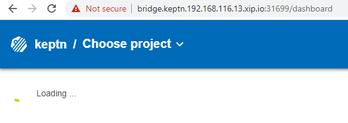
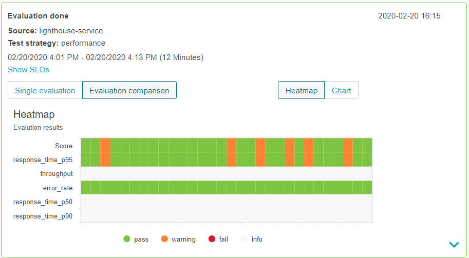
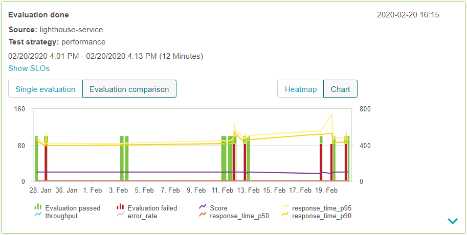
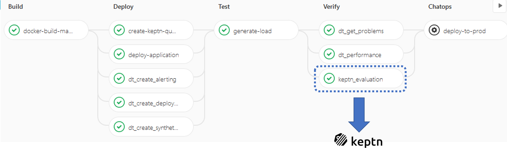

# Keptn Quality Gates on Minikube

This is a step-by-step guide to install Keptn 0.6 Quality Gates on Minikube only needing 2vCPUs, 2GB RAM & 20GB Disk!
The intention of this tutorial is to refine it and then bring it over to the Keptn Doc. So - I need your help and feedback to validate these steps also work on your machine. Thanks in advance!

I have been running through this on my Windows 10 with HyperV enabled. It should work the same regardless of the OS and Hypervisor as long as Minikube supports it!

## 1. Install Minikube

All instructions on how to install Minikube can be found here: https://kubernetes.io/docs/tasks/tools/install-minikube/
Here are the steps I did on my Windows 10 machine
1: Validate that I have Hyper-V installed & enabled
```
systeminfo
```

2: Install Minikube
Just follow the instructions on https://kubernetes.io/docs/tasks/tools/install-minikube/
In my case I opened Powershell and did this:
```
choco install minikube
```
As an alternative on Windows you can also download the Windows Installer: https://docs.microsoft.com/en-us/windows/desktop/msi/windows-installer-portal 

## 2: Start Minikube

There are different start options for minikube where you can specify which hypervisor to use, default size of VMs ... - you can find more information here: https://kubernetes.io/docs/setup/learning-environment/minikube/#specifying-the-vm-driver 
I just went with the default and specified hyperv as my hypervisor:
```
minikube start --vm-driver=hyperv
```

## 3: Access Kubectl

After Minikube spun up my cluster I made sure that I can access it via kubectl. You can either run minikube kubectl or just kubectl directly as minikube start should have created the kubectl config for you:
```
PS> kubectl get nodes
NAME       STATUS   ROLES    AGE    VERSION
minikube   Ready    master   2m     v1.17.3
```

## 4: Install Keptn

After downloading the Keptn CLI for 0.6 (https://github.com/keptn/keptn/releases/tag/0.6.0) I ran the following command from my Powershell:
```
./keptn install --platform=kubernetes --use-case=quality-gates --gateway=NodePort --verbose
```

This will install Keptn on the current kubectl configured cluster. It will also just install the components necessary for Quality Gates.
It is important to note here that gateway=NodePort. Keptn will install an Nginx as Ingress. By default it uses LoadBalancer node type but in our case we just bind it to the IP of the Minikube Cluster Node which is why we specify NodePort. This means that our Nginx Ingress will later be available through the Virtual IP of our Minikube Cluster Node. --verbose is always great as we get to see more details during the installation process

## 5: Validate Keptn Installation

Just execute ./keptn status and you will also get your API Endpoint:
```
PS> ./keptn status
Starting to authenticate
Successfully authenticated
CLI is authenticated against the Keptn cluster https://api.keptn.192.168.xxx.yy.xip.io:PORT
```

Now you can open your browser and navigate to https://api.keptn.192.168.xxx.yy.xip.io:PORT/swagger-ui. Make sure to add the /swagger-ui and also bypass the warning about the certificate. 

You probably have noticed that we are using xip.io to resolve the DNS. Thanks to the folks who provide xip.io - its a really useful service to avoid setting up your own domain and DNS.

## 6: Expose Bridge

One of the best things in Keptn is the Keptn's Bridge as it gives us an overivew of all our projects, services and deployments. By default the Bridge is not exposed to the outside world which is why we need to create a new virtual service to expose it via our Nginx Ingress.
I prepared a bridge.yaml file. All you need to do is EDIT that file an replace the two instances of DOMAIN_PLACEHOLDER with your internal IP, e.g: 192.168.1.2.
After that just do this:
```
kubectl apply -f bridge.yaml
```

Now you can open your browser and navigate to: https://bridge.keptn.192.168.xxx.yy.xip.io:PORT

## 7: Get the latest Bridge

Since 0.6 GA was released our engineers have done some great work on the new bridge which we are providing through the Early Adopter Program. Make sure to follow the instructions as explained here to get the new bridge: https://keptn.sh/docs/0.6.0/reference/keptnsbridge/#early-access-version-of-keptn-s-bridge - its really just 2 commands!

Here is how the bridge looks like - not much data in there yet because we dont yet have a project created - but it works :-)


## 8: Create your project, onboard your services ...

As we now have Keptn running on Minikube we can go on with creating a project, onboarding a service, uploading our SLIs & SLOs, configuring our SLI provider and then run our first evaluations ...

I will extend this tutorial with my own example but you can simply continue by following the steps as explained in the Keptn Docs: https://keptn.sh/docs/0.6.0/usecases/quality-gates/#configure-keptn-and-activate-the-quality-gate

# Quality Gate Result Visualization

Here two screenshots showing the quality gate result visualization of the current early adopter Keptn'S Bridge. I ran it against my sample app where I let the quality gate pull in a couple of SLIs from Dynatrace and then evaluate them against my SLOs which leverage both static but also relative thresholds. Pretty slick :-)


Image #1: Heatmap Visualization


Image #2: Chart Visualization

# Integration with your Delivery Pipelines

The key use case of the Keptn Quality Gates standalone is to integrate it with your existing CI/CD pipeline tools such as Jenkins, ArgoCD, GitLab Pipelines, Azure DevOps, AWS CodePipeline, Harness, Tekton ...
You can either call the Keptn CLI to kick off an evaluation after you have deployed your new artifacts and ran your builds or you can use the Keptn API to do the same.

I will extend this tutorial with more details - but - check out what Christian Heckelmann has done for his GitLab Pipelines. He integrated Keptn Quality Gates and provides his scripts in his GitLab repo: 
* GitLab Pipeline Sample Repo: https://gitlab.com/checkelmann/dynatrace-pipeline/-/tree/master
* Keptn Evaluation Include: https://gitlab.com/checkelmann/dynatrace-pipeline/-/blob/master/ci-includes/keptn_evaluation.yaml



# Tips & Tricks

## 1: Restarting Minikube!

If you stop/start your Minikube it is likely that your Minikube node gets a different IP after each restart. If that is the case you won't be able to access the the API or Bridge anylonger under initial configured endpoints. Happened to me as well which is why I want to tell you how to update the configuration in case you get a new IP after a restart:
1: Get the new internal cluster node IP
```
kubectl describe nodes
```

2: Edit both ingress configurations and fix the IP
```
kubectl edit ingress api-ingress -n keptn
kubectl edit ingress bridge-ingress -n keptn
```

3: Update Keptn's domain info in its Config Map
```
kubectl edit cm keptn-domain -n keptn
```

Thats it! 