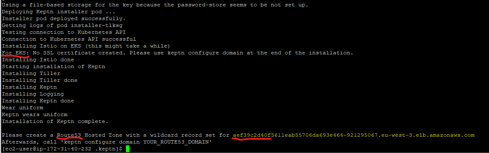
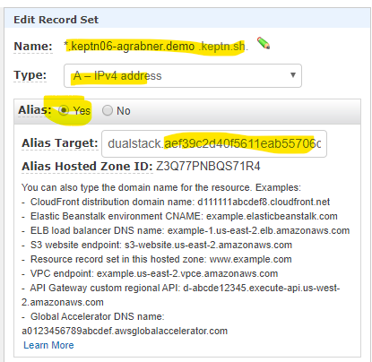
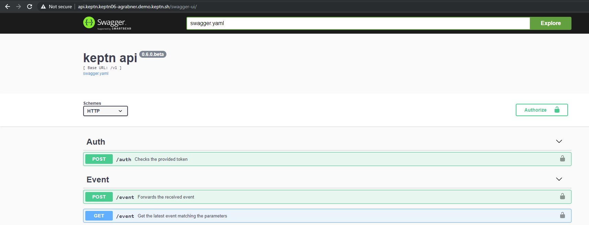

# Keptn Quality Gates on EKS for Services Deployed w Keptn and Monitored w Dynatrace

In this tutorial we will be 
1. Install a new EKS cluster
2. Install keptn 0.6 on that cluster including Dynatrace Service
3. Create a keptn project with a 2 stage shipyard definition
4. Onboard a simple service and configure Dynatrace SLI for quality gates
5. Deploy the simple service with keptn and have quality gates enforced

# PreRequ: Git Repo, Dynatrace Token

There are things we need to work with keptn and connect it with Dynatrace

## PreReq.2 Git Repo
Keptn installs its own Git. In order to modify SLIs & SLOs that are managed by keptn we will define a remote git upstream. Feel free to use GitHub, GitLab, Bitbucket or any other Git service. What you need are these 3 things
1. **GIT_REMOTE_URL**: Create a Remote Git Hub Repo that includes a Readme.md
2. **GIT_USER**: Your git user to login
3. **GIT_TOKEN**: A token for your git that allows keptn to push updates to that repo

In my case I simply create a GitHub repo like this:


## PreReq.2 Dynatrace Token
This example shows keptn quality gates based on Dynatrace metrics using the new [Dynatrace Metrics v2 API](https://www.dynatrace.com/support/help/extend-dynatrace/dynatrace-api/environment-api/metric/).
Hence you need Dynatrace that instruments the services you want to validate SLOs against. In order for keptn to automate that validation we need two things:
1. **Dynatrace URL**: Thats e.g: https://abc12345.dynatrace.live.com (for SaaS) or your https://managedservice/e/yourenvioronment (for Managed)
2. **Dynatrace API Token**: Please create a Dynatrace API token with access to timeseries as well as read & write configuration (for my advanced service metric SLIs)
3. **Dynatrace PAAS API Token**: Please create a Dynatrace PaaS token which will be used to rollout the OneAgent on your EKS cluster


# 1. Installing EKS Cluster & Keptn
## 1.1 Install Required Tools: aws, kubectl, eksctl, git

If you have aws, kubectl & eksctl installed on your local workstation go ahead with those.
If not you can follow my approach which is launching a t2.micro Amazon Linux EC2 and then execute the following
First we configure our AWS CLI to connect to your AWS Account
```
aws configure
```

Now we install aws-iam-authenticator as described [here](https://docs.aws.amazon.com/eks/latest/userguide/install-aws-iam-authenticator.html)
```
curl -o aws-iam-authenticator https://amazon-eks.s3-us-west-2.amazonaws.com/1.14.6/2019-08-22/bin/linux/amd64/aws-iam-authenticator
chmod +x ./aws-iam-authenticator
mkdir -p $HOME/bin && cp ./aws-iam-authenticator $HOME/bin/aws-iam-authenticator && export PATH=$HOME/bin:$PATH
echo 'export PATH=$HOME/bin:$PATH' >> ~/.bashrc
aws-iam-authenticator help
```

Next is installing kubectl:
```
curl -o kubectl https://amazon-eks.s3-us-west-2.amazonaws.com/1.14.6/2019-08-22/bin/linux/amd64/kubectl
chmod +x ./kubectl
mkdir -p $HOME/bin && cp ./kubectl $HOME/bin/kubectl && export PATH=$HOME/bin:$PATH
echo 'export PATH=$HOME/bin:$PATH' >> ~/.bash_profile
```

Last is eksctl:
```
curl --silent --location "https://github.com/weaveworks/eksctl/releases/download/latest_release/eksctl_$(uname -s)_amd64.tar.gz" | tar xz -C /tmp
sudo mv /tmp/eksctl /usr/local/bin
```

As we need some files from this Git repo later on our workstation lets install git and clone this repository:
```
sudo yum install git
git clone https://github.com/grabnerandi/keptn-qualitygate-examples
```

## 1.2 Create EKS cluster with kubectl
For our sample app we can work with a single node EKS cluster with node type m5.xlarge. To create that cluster we execute. Feel free to use a different cluster name or region. I decided to call the cluster keptn06 and put it in region eu-west-3!
```
eksctl create cluster --version=1.14 --name=keptn06 --node-type=m5.xlarge --nodes=1 --region=eu-west-3
```

At the end of the installation eksctl should automatically create a kubectl config entry. If that didnt work you can create your own config entry as described [here](https://docs.aws.amazon.com/eks/latest/userguide/create-kubeconfig.html)
```
aws eks --region eu-west-03 update-kubeconfig --name keptn06
```

## 1.3 Install Keptn

First we download the keptn CLI (right now 0.6.0.beta)
```
wget https://github.com/keptn/keptn/releases/download/0.6.0.beta/0.6.0.beta_keptn-linux.tar
tar -xvf 0.6.0.beta_keptn-linux.tar
chmod +x keptn
sudo mv keptn /usr/local/bin/keptn
```

Now we can install keptn. Via the --keptn-version flag we specify that we want 0.6.0.beta
```
keptn install --platform=eks --keptn-version=release-0.6.0.beta
```
Here is a sample output:


As the output explains, keptn installs Istio and with that comes an Ingress Gateway. In order to access the keptn API, the bridge and the deployed services we need to create a Route53 entry that points to that ALB that EKS automatically created for us. In order to do this go to your Route53 and create a wildcard domain for your keptn installation. In my case I chose keptn06-agrabner.demo.keptn.sh and point it to the ALB that was created for me:


Now we configure keptn to be aware of this domain to correctly handle incoming requests on *.YOURKEPTNDOMAIN. Here is the call for my domain (make sure you use your Route53 domain):
```
keptn configure domain keptn06-agrabner.demo.keptn.sh
```
At the end the output should say: CLI is authenticated against the Keptn cluster https://api.keptn.keptn06-agrabner.demo.keptn.sh

You can validate that this really works by opening the browser to that API URL and append /swagger-ui. There might be a security warning in your browser that the certificate is not trusted. Feel free to trust that certificate which will get you to the Swagger UI:



## 1.4 Expose Keptn Bridge

Last thing we do is to expose the Keptn's bridge to the outside world. By default the bridge is not exposed and only accessible internally - but - for our use case it is ok to expose it as a virtual service so we can access it via https://bridge.keptn.YOURDOMAIN.

```
./keptn/exposeBridge.sh
```
You should now be able to access the Keptns Bridge via the URL shown in the exposeBridge.sh output

## 1.5 Install Dynatrace Service

The Dynatrace Keptn Service pushes certain events (Deployment, Test, Evaluation ...) to Dynatrace to those monitored Dynatrace entities that are impacted by that event. In order for this to work the Dynatrace OneAgent must also be monitoring our EKS cluster. By following the instructions on the [Dynatrace Keptn Service](https://github.com/keptn-contrib/dynatrace-service/tree/release-0.4.0)
```
cd ~
git clone --branch 0.4.0 https://github.com/keptn-contrib/dynatrace-service --single-branch
cd dynatrace-service/deploy/scripts
./defineDynatraceCredentials.sh
./deployDynatraceOnGKE.sh
```

In a few seconds you should start seeing data in Dynatrace for your monitored EKS cluster. Navigate to your Hosts and click on the new entry.

# 3. Configure Keptn to manage our Simpleservice

In order for keptn to take control for automated delivery and operations for our application we need to do the following
1. Create a keptn project called keptn06_sample with a two stage shipyard file
2. Onboard our service called simpleservice with a pre-defined helm chart
3. Upload supporting files such as SLIs, SLOs & tests
4. Configure Dynatrace SLI Service